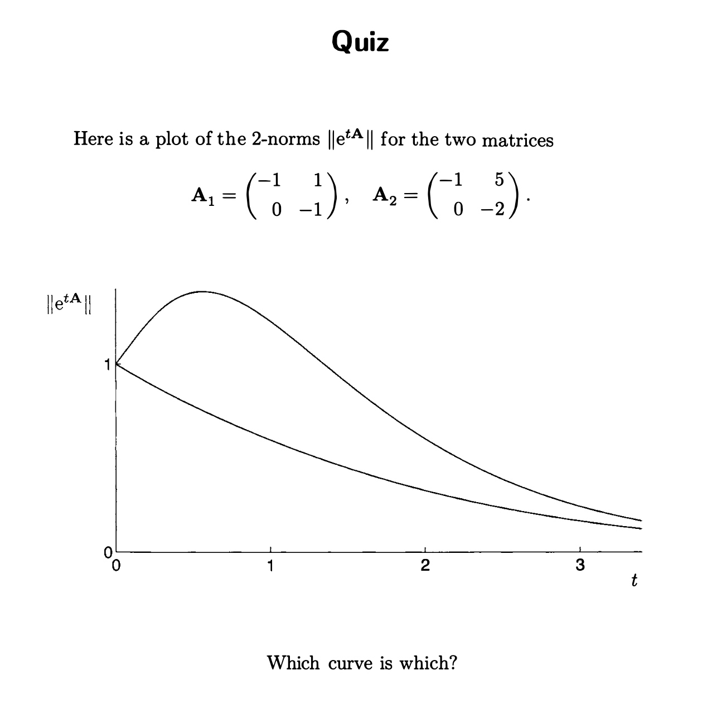

+++
date = '2026-05-08T16:17:52+08:00'
draft = true
title = 'SAPA'
+++

我们这里看一下spectra and pseudospectra这本书，我们主要是要理解一下这种非正规性究竟会带来什么，在物理上这种非正规性会出现在很多地方，比如一个Markov矩阵，他的转移概率矩阵可能会导致细致平衡的破坏，那么会出现环流。而近来也有一些研究发现这种非正规性会导致系统的瞬态行为受到剧烈的影响，正如这本书扉页上的quiz所示，本征值的行为其实无法概括系统的瞬时行为，

本征值其实只能去处理$t\rightarrow \infty$的情况。那我们为什么要关注这种瞬态的行为呢？我这里给出一个场景，就是我在不断的改变我的参数，在这种情况下，如果我粗略的认为体系是一个阶梯状的参数ramp up的过程中，那么每个参数点上停留的时间可能是有限的，那么势必重要的是这些瞬时的行为。

除了这些之外，这种非正规性在非厄米领域中已经被人们注意到了，比方说人们关注的Petermann因子，在数学上是用来衡量敏感度的，在物理上被发现可能与噪声的放大有关。在随机热力学中，我想这也是一个重要且有意思的问题。在比方说，NH skin effect，这个现象最近被发现和伪谱有关

